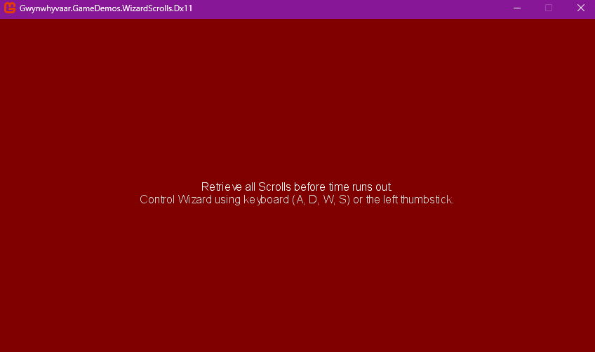
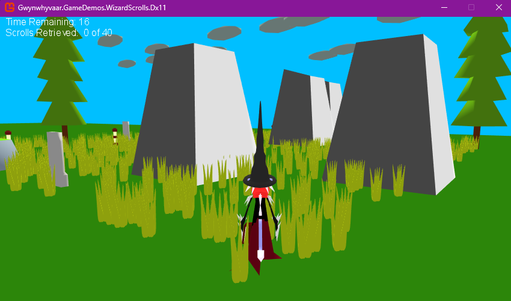

# Wizards and Scrolls

My modification of the "Fuel Cell" XNA sample -The (old) XNA diary can be gotten from here: https://learn.microsoft.com/en-us/previous-versions/windows/xna/dd254733(v=xnagamestudio.30).

An updated diary for MonoGame can be gotten from here https://github.com/MonoGame/MonoGame.Samples/blob/3.8.1/FuelCell/Documentation/1-FuelCell-Game-design.md , which was helpful as it focused on design concepts as dependency injection.

This was a fun project and gave me useful understanding on some core XNA/ Monogame concepts; also allowed me to create compononents I will find useful as building blocks for any 3D based game I want to make outside of Unity 3d.

## Acknowlegments

- Music samples were gotten from : https://pixabay.com/music/search/dungeon%20synth/
- I used Anim8or to create the 3D models and Autodesk FBX Converter for the .FBX file conversions (Blender was a hassle at the moment)
